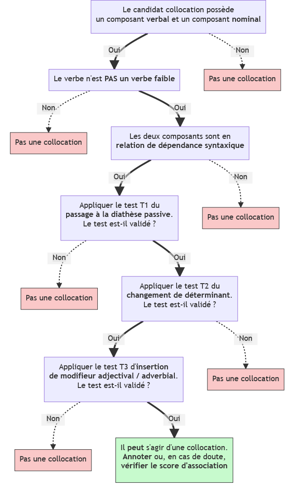
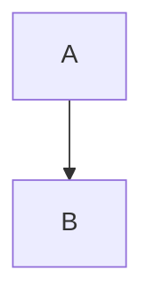

# Guide d'annotation : *Corpus parallèles et annotation des collocations*

## Bastien Giordano
### dir. : Amalia Todirascu (Unistra), Frédéric Imbert (AMU)

---

## Table des matières
- **(1)** [Contexte](#1-contexte)
- **(2)** [Collocations : définition et particularités](#2-collocations--définition-et-particularités)
	- **(2.1)** [Identification d'une collocation](#21-identification-dune-collocation)
	- **(2.2)** [Différences avec d'autres expressions polylexicales](#22-différences-avec-dautres-expressions-polylexicales)
	- **(2.3)** [Délimitation](#23-délimitation)
- **(3)** [Tests linguistiques](#3-tests-linguistiques)
	- **(3.1)** [Arbre de décision générique](#31-arbre-de-décision-générique)
	- **(T1)** [Passage à la diathèse passive](#t1-passage-à-la-diathèse-passive)
	- **(T2)** [Changement de déterminant](#t2-changement-de-déterminant)
	- **(T3)** [Insertion de modifieurs](#t3-insertion-de-modifieurs)
- [Références bibliographiques](#références-bibliographiques)

---

## (1) Contexte

Les **corpus parallèles** contiennent habituellement au moins deux textes, un original et sa traduction, ayant été au préalable alignés au niveau de la phrase. Ce sont des ressources très importantes pour plusieurs domaines, notamment pour le traitement automatique des langues (TAL) : 

- Enseignement des langues étrangères,
- Etudes en traductologie,
- Entraînement de systèmes de traduction automatique (TA),
- Construction de ressources lexicales telles que des dictionnaires spécialisés.

Malgré cela, les **corpus parallèles annotés** manquent cruellement. Dans le cadre de ce projet de mémoire de master intitulé **Corpus parallèles et annotation des collocations**, nous nous proposons de créer un **corpus parallèle trilingue** (français, anglais, arabe) multi-genre annoté en collocations. Ces annotations, du moins pour le français, sont faites de manière semi-automatique : nous entraînons un outil d'annotation automatique, [**VarIDE**](#https://gitlab.com/cpasquer/SharedTask2018_varIDE) [(Pasquer *et al.*, 2018)](#https://hal.archives-ouvertes.fr/hal-01866364/file/article_ST.pdf), avec un corpus CoNLL-U annoté manuellement, afin qu'il puisse annoter automatiquement de nouveaux textes. Ces nouvelles annotations sont ensuite revues, corrigées et augmentées manuellement, selon les résultats obtenus.

La méthodologie adoptée est très largement inspirée des pratiques du projet [**PARSEME**](#https://typo.uni-konstanz.de/parseme/) [(Savary *et al.*, 2015)](#https://hal.archives-ouvertes.fr/hal-01223349/file/parseme-ltc-2015.pdf), campagne d'annotation massive ayant eu pour but d'annoter les expressions polylexicales verbales dans 22 langues. Ces expressions polylexicales ont été réparties en plusieurs catégories : expressions idiomatiques, verbes à particule, verbes réfléchis. En revanche, les collocations n'ont pas été annotées, le cadre théorique du projet considérant que ces dernières ne sont que des associations de termes se manifestant uniquement sur des bases statistiques.

Dans le cadre de notre projet, nous avons adopté la définition de [Kim et Baldwin (2010)](#https://people.eng.unimelb.edu.au/tbaldwin/pubs/altss2004.pdf), selon laquelle les collocations sont des expressions polylexicales à part entière, caractérisées par une forte affinité lexicale entre leurs composants internes, qui peuvent se manifester tant pour des raisons syntaxiques, sémantiques, pragmatiques, que statistiques. La portée de ce projet devant se restreindre à ce qui est faisable dans le temps imparti pour un mémoire de master, nous annotons uniquement les collocations verbales. Nous définissons les tests linguistiques pour les trois langues ci-après.

---

## (2) Collocations : définition et particularités

### (2.1) Identification d'une collocation

Nous annotons les collocations qui sont par définition intrinsèquement composées de **deux parties**, contenant au moins un terme chacune. Ces collocations doivent être formées **à partir d'un verbe**. De plus, ces unités lexicales doivent être **en relation de dépendance syntaxique** (sujet-verbe, verbe-objet direct, verbe-objet indirect, verbe-complément circonstanciel).

Les collocations manifestent une attirance, une préférence lexicale forte : un locuteur natif utilisera toujours l'association *poser-question*plutôt que *demander-question*. Le sens est compositionnel. Ce phénomène linguistique manifeste une grande variabilité syntaxique : on peut insérer des modifieurs adverbiaux (*poser* prestement *une question*) ou adjectifs (*poser une question* bête). La diathèse passive est également possible (*une question a été posée*). Les composants de la collocation résistent quand on applique des tests de substitution, par exemple avec le remplacement d'un nom par un synonyme. Ce remplacement implique généralement un changement de sens.

Il est utile et recommandé, pour le français, de se référer à la ressource [**Voisins de Wikipédia**](http://redac.univ-tlse2.fr/voisinsdewikipedia/) pour vérifier si les mesures d'association entre le verbe et le nom de la collocation sont assez fortes. Aucun seuil ne peut être totalement établi, mais une information mutuelle (IM) supérieure à 6 avec un certain nombre d'occurrences repérées sont de bons indices.

---

### (2.2) Différences avec d'autres expressions polylexicales

Parmi les différents types d'expressions polylexicales, on compte énormément d'expressions figées et idiomatiques. Il est nécessaire de pouvoir différencier ces dernières des collocations, afin de ne pas faire d'erreur d'annotation.

Les expressions figées peuvent être scindées en deux groupes : d'une part, il y a les expressions dont le verbe (généralement un verbe faible) est variable, mais dont l'objet est totalement fixe (*avoir peur*, *être sans espoir*). D'autre part, il y a les expressions ayant une valeur pragmatique (les pragmatèmes de [Tutin (2015)](#https://hal.archives-ouvertes.fr/hal-01348549/file/Europhras2015_Tutin_et_al_vfinale.pdf)) : *il fait chaud*, *il fait froid*. Il est impossible d'y insérer de déterminant, d'adjectif ou de relative.

Les expressions idiomatiques, quant à elles, disposent d'un sens figuré. Il est impossible, sans connaissances extra-linguistiques, de déduire le sens d'une telle expression d'après ses composants : *jeter un sort*, *perdre pied*, *jeter l'éponge*. Outre cet arguement, trois caractéristiques peuvent nous aiguiller : 1) ces unités dénotent d'un figement syntaxique important (préférence pour un déterminant particulier : *?jeter une éponge*, *?jeter les éponges*) ; 2) il est impossible d'appliquer un modifieur au nom (*?jeter l'éponge bleue*) ; et 3) le passage à la diathèse passive est impossible ou difficilement acceptable sans changement de sens ou une ironie marquée (*?l'éponge a été jetée*).

--- 

### (2.3) Délimitation

L'annotation des collocations se fait en premier lieu avec l'application d'un outil automatique, VarIDE (Pasquer *et al.*, 2018). Ce dernier prend en entrée un fichier au format `cupt` (format CoNLL-U étendu) annoté et sa sortie est un autre fichier du même format. Voici un exemple annoté :

	# text = Ils lui ont rendu un hommage des plus émouvants.
	1	Ils	il	PRON	_	Gender=Masc|Number=Plur|Person=3|PronType=Prs	4	nsubj	_	_	*
	2	lui	lui	PRON	_	Number=Sing|Person=3|PronType=Prs	4	iobj	_	_	*
	3	ont	avoir	AUX	_	Mood=Ind|Number=Plur|Person=3|Tense=Pres|VerbForm=Fin	4	aux:tense	_	_	*
	4	rendu	rendre	VERB	_	Gender=Masc|Number=Sing|Tense=Past|VerbForm=Part	0	root	_	_	1:COLL
	5	un	un	DET	_	Definite=Ind|Gender=Masc|Number=Sing|PronType=Art	6	det	_	_	*
	6	hommage	hommage	NOUN	_	Gender=Masc|Number=Sing	4	obj	_	_	1
	7-8	des	_	_	_	_	_	_	_	_	*
	7	de	de	ADP	_	_	10	case	_	_	*
	8	les	le	DET	_	Definite=Def|Number=Plur|PronType=Art	10	det	_	_	*
	9	plus	plus	ADV	_	_	10	advmod	_	_	*
	10	émouvants	émouvant	ADJ	_	Gender=Masc|Number=Plur	6	nmod	_	_	*
	11	.	.	PUNCT	_	_	4	punct	_	_	*

**La 11ème colonne contient les annotations pour ce projet**. Si le token identifié ne fait pas partie d'une collocation, elle contient une astérisque `*`. Dans le cas contraire, le premier token de la collocation est marqué par un chiffre, correspondant au numéro de la collocation trouvée dans la phrase en question, suivi de deux-points `:` et de `COLL`, tandis que les autres éléments de la collocation ne sont notés qu'avec le chiffre. 

Dans l'exemple ci-dessus, on peut se rendre compte que seuls le verbe (*rendre* ⇒ `1:COLL`) et le nom objet direct (*hommage* ⇒ `1`) sont annotés. De fait, nous ne prenons pas en considération les déterminants, ni les modifieurs adverbiaux ou adjectivaux.

Nous n'annotons pas non plus les auxiliaires lorsque le verbe est conjugué à un temps composé, comme l'illustre l'exemple ci-dessous :

	# text = Le prix Goncourt lui a été décerné en 1992.
	1	Le	le	DET	_	Definite=Def|Gender=Masc|Number=Sing|PronType=Art	2	det	_	_	*
	2	prix	prix	NOUN	_	Gender=Masc|Number=Sing	7	nsubj:pass	_	_	1:COLL
	3	Goncourt	Goncourt	PROPN	_	_	2	appos	_	_	*
	4	lui	lui	PRON	_	Number=Sing|Person=3|PronType=Prs	7	iobj	_	_	*
	5	a	avoir	AUX	_	Mood=Ind|Number=Sing|Person=3|Tense=Pres|VerbForm=Fin	7	aux	_	_	*
	6	été	être	AUX	_	Gender=Masc|Number=Sing|Tense=Past|VerbForm=Part	7	aux:pass	_	_	*
	7	décerné	décerner	VERB	_	Gender=Masc|Number=Sing|Tense=Past|VerbForm=Part	0	root	_	_	1
	8	en	en	ADP	_	_	9	case	_	_	*
	9	1992	1992	NUM	_	_	7	obl	_	SpaceAfter=No	*
	10	.	.	PUNCT	_	_	7	punct	_	_	*

Ni le déterminant *le* ni les auxiliaires *avoir* et *être* ne sont annotés. Notons par ailleurs que si le verbe de la collocation est sous une forme participiale, elle doit être annotée, comme l'illustre l'exemple ci-après :

	# text = Le bilan dressé par le vice-président fait apparaître un solde financier positif.
	1	Le	le	DET	_	Definite=Def|Gender=Masc|Number=Sing|PronType=Art	15	det	_	_	*
	2	bilan	bilan	NOUN	_	Gender=Masc|Number=Sing	25	nsubj:caus	_	_	1:COLL
	3	dressé	dresser	VERB	_	Gender=Masc|Number=Sing|Tense=Past|VerbForm=Part	15	acl	_	_	1
	4	par	par	ADP	_	_	19	case	_	_	*
	5	le	le	DET	_	Definite=Def|Gender=Masc|Number=Sing|PronType=Art	19	det	_	_	*
	6	vice-président	vice-président	NOUN	_	Gender=Masc|Number=Sing	16	obl:agent	_	SpaceAfter=No	*
	7	fait	faire	AUX	_	Mood=Ind|Number=Sing|Person=3|Tense=Pres|VerbForm=Fin	25	aux:caus	_	_	*
	8	apparaître	apparaître	VERB	_	VerbForm=Inf	0	root	_	_	*
	9	un	un	DET	_	Definite=Ind|Gender=Masc|Number=Sing|PronType=Art	27	det	_	_	*
	10	solde	solde	NOUN	_	Gender=Masc|Number=Sing	25	obj:agent	_	_	*
	11	financier	financier	ADJ	_	Gender=Masc|Number=Sing	27	amod	_	_	*
	12	positif	positif	ADJ	_	Gender=Masc|Number=Sing	27	amod	_	SpaceAfter=No	*
	13	.	.	PUNCT	_	_	25	punct	_	_	*

En revanche, les prépositions, si elles sont inscrites dans le régime du verbe, doivent être annotées. Voir l'exemple suivant :

	# text = La gendarmerie a procédé au constat d'usage.
	1	La	le	DET	_	Definite=Def|Gender=Fem|Number=Sing|PronType=Art	4	det	_	_	*
	2	gendarmerie	gendarmerie	NOUN	_	Gender=Fem|Number=Sing	10	obl	_	_	*
	3	a	avoir	AUX	_	Mood=Ind|Number=Sing|Person=3|Tense=Pres|VerbForm=Fin	10	aux	_	_	*
	4	procédé	procéder	VERB	_	Gender=Masc|Number=Sing|Tense=Past|VerbForm=Part	0	root	_	_	1:COLL
	5-6	au	_	_	_	_	_	_	_	_	*
	5	à	à	ADP	_	_	13	case	_	_	1
	6	le	le	DET	_	Definite=Def|Gender=Masc|Number=Sing|PronType=Art	13	det	_	_	*
	7	constat	constat	NOUN	_	Gender=Masc|Number=Sing	10	obl	_	_	1
	8	d'	de	ADP	_	_	15	case	_	SpaceAfter=No	*
	9	usage	usage	NOUN	_	Gender=Masc|Number=Sing	13	nmod	_	SpaceAfter=No	*
	10	.	.	PUNCT	_	_	10	punct	_	_	*

D'une manière générale, les annotations peuvent être continues ou discontinues, mais elles sont plus souvent discontinues, car nous n'annotons ni les déterminants, ni les modifieurs, qu'ils soient adjectivaux ou adverbiaux. **En effet, nous considérons qu'une collocation est continue uniquement lorsque les tokens la composant sont contigus.**

--- 

## (3) Tests linguistiques

### (3.1) Arbre de décision générique

test

---

### (T1) Passage à la diathèse passive

Le passage à la diathèse passive est le premier test à appliquer. Il consiste simplement à vérifier et trancher que le candidat-collocation n'est pas une expression figée ou idiomatique.

#### FR :fr:

##### Exemple vérifiant le test

__Phrase :__ *Le 4 juin, la République démocratique d'Arménie dut __signer__ le __traité__ de Batoumi.*  
__Application de T1 :__ * *Le 4 juin, le __traité__ de Batoumi __a été signé__ par la République démocratique d'Arménie.*  
Le sens est-il toujours le même ? Le passage à la diathèse passive est-il tout simplement possible ?  
↳ OUI ⇒ T2  
Le test est satisfait.  

##### Exemple récusant le test

__Phrase :__ *Elle aurait décidé de __jeter__ l'__éponge__ après son dernier combat.*  
__Application de T1 :__ *? L'__éponge__ __aurait été jetée__ après son dernier combat.*  
Le sens est-il toujours le même ? Le passage à la diathèse passive est-il tout simplement possible ?  
↳ NON ⇒ Pas une collocation.  
Dans ce cas-là, le sens *abandonner* de *jeter l'éponge* n'est pas restitué à la diathèse passive ; le sens est littéral, bien que la transformation soit possible. Le test est récusé.  

#### EN :uk: :us:

##### Exemple vérifiant le test

__Phrase :__ *On June 4, the Democratic Republic of Armenia was forced to __sign__ the __Treaty__ of Batum.*  
__Application de T1 :__ *On June 4, the __Treaty__ of Batum __was signed__ by the Democratic Republic of Armenia under force.*  
Le sens est-il toujours le même ? Le passage à la diathèse passive est-il tout simplement possible ?  
↳ OUI ⇒ T2  
Le test est satisfait.

##### Exemple récusant le test

__Phrase :__ *Under pressure, she felt she had no choice and __spilled__ the __beans__.*  
__Application de T1 :__ *? Under pressure, she felt she had no choice and the __beans were spilled__.*  
Le sens est-il toujours le même ? Le passage à la diathèse passive est-il tout simplement possible ?  
↳ NON ⇒ Pas une collocation.  
Dans ce cas-là, le sens *vendre la mèche* de *spill the beans* n'est pas restitué à la diathèse passive ; le sens est littéral, bien que la transformation soit possible. Le test est récusé.  

#### AR :saudi_arabia:

##### Exemple vérifiant le test

__Phrase :__ أثنى ناصر على ايزنهاور، مشيرا إلى أنه __لعب__ "أكبر __الأدوار__ وأكثرها حسما" في وقف "المؤامرة الثلاثية".  
__Traduction :__ *Nasser fit l'éloge d'Eisenhower et déclara qu'il avait __joué__ « le __rôle__ le plus décisif » dans l'arrêt de la « conspiration tripartite ».*   
__Application de T1 :__ أثنى  ناصر على ايزنهاور، مشيرا إلى أنّ __الدور__ الذي __لُعِبَ__ "أكبر وأكثرها حسما" في وقت "المؤامرة الثلاثية".  
__Traduction :__  *Nasser fit l'éloge d'Eisenhower et déclara que le rôle qui a été joué fut « le plus décisif » dans l'arrêt de la « conspiration tripartite ».*  
Le sens est-il toujours le même ? Le passage à la diathèse passive est-il tout simplement possible ?  
↳ OUI ⇒ T2  
Le test est satisfait.  

##### Exemple récusant le test

__Phrase :__  
__Traduction :__  
__Application de T1 :__  
__Traduction :__  
Le sens est-il toujours le même ? Le passage à la diathèse passive est-il tout simplement possible ?  
↳ NON ⇒ Pas une collocation.  
Dans ce cas-là, ... Le test est récusé.  

---

### (T2) Changement de déterminant

Le test du changement (ou d'insertion) de déterminant est le second à effectuer. 

#### FR :fr:

##### Exemple vérifiant le test

__Phrase :__ *Ils nous ont permis de __raconter l'histoire__ du neuromarketing.*  
__Application de T2 :__ *Ils nous ont permis de __raconter une / mon / son / cette histoire__.*  
Le sens est-il toujours le même ? L'insertion ou le changement de déterminant sont-ils tout simplement possibles ?  
↳ OUI ⇒ T3  
Le test est satisfait.  

##### Exemple récusant le test

__Phrase :__ *Il a finalement __découvert le pot aux roses__.*    
__Application de T2 :__ *\* Il a finalement __découvert un / mon / son / ce pot aux roses__.*  
Le sens est-il toujours le même ? L'insertion ou le changement de déterminant sont-ils tout simplement possibles ?  
↳ NON ⇒ Pas une collocation.  
Le test est récusé.  

#### EN :uk: :us:

##### Exemple vérifiant le test

__Phrase :__ *And I __asked__ myself __the question__: How is it possible that we could be so poor here in the United States, because coal is such a wealthy resource; it's so much money?*      
__Application de T2 :__ *And I __asked__ myself __a / this / that question__: (...*)  
Le sens est-il toujours le même ? L'insertion ou le changement de déterminant sont-ils tout simplement possibles ?  
↳ OUI ⇒ T3  
Le test est satisfait. 

##### Exemple récusant le test

__Phrase :__ *She __beat around the bush__ and never answered my question.*  
__Application de T2 :__ *\* She __beat around a / this / that bush__ and never answered my question.*  
Le sens est-il toujours le même ? L'insertion ou le changement de déterminant sont-ils tout simplement possibles ?  
↳ NON ⇒ Pas une collocation.  
Le test est récusé.  

#### AR :saudi_arabia:

##### Exemple vérifiant le test

__Phrase :__ نظرية دارون للانتقاء الطبيعي بديعه بشكل مذهل.. لأنها __تحل معضلة__ تفسير التعقيد (في الحياة) بطريقة سهلة وواضحة.  
__Traduction :__ *La sélection naturelle de Darwin est brillamment élégante car elle __résout le problème__ de la complexité en n'utilisant rien d'autre que la simplicité.*  
__Application de T2 :__ نظرية دارون للانتقاء الطبيعي بديعه بشكل مذهل.. لأنها __تحل معضلة / معضلتكم / هذه المعضلة__.  
__Traduction :__  *La sélection naturelle de Darwin est brillamment élégante car elle __résout un / votre / ce problème__ (...)*  
Le sens est-il toujours le même ? L'insertion ou le changement de déterminant sont-ils tout simplement possibles ?  
↳ OUI ⇒ T3   
Le test est satisfait.  

##### Exemple récusant le test

__Phrase :__    
__Application de T2 :__  
Le sens est-il toujours le même ? L'insertion ou le changement de déterminant sont-ils tout simplement possibles ?  
↳ NON ⇒ Pas une collocation.  
Le test est récusé.  

---

### (T3) Insertion de modifieurs

Le test d'insertion de modifieurs adjectivaux ou adverbiaux est le dernier à effectuer.  

#### FR :fr:

##### Exemple vérifiant le test

__Phrase :__ *L'UNICEF a aussi __foré des puits__ dans les écoles, les hôpitaux et les dispensaires.*  
__Application de T3 :__ *L'UNICEF a aussi __foré d'immenses puits__ dans les écoles, les hôpitaux et les dispensaires.*  
Le sens est-il toujours le même ? L'insertion d'un modifieur est-elle tout simplement possible ?  
↳ OUI ⇒ Le test est satisfait.  
Annoter ou, en cas de doute, vérifier l'information mutuelle des composants de la collocation.    

##### Exemple récusant le test

__Phrase :__ *Elle ne peut s'empêcher de __raconter des salades__.*  
__Application de T3 :__  * *Elle ne peut s'empêcher de __raconter des salades incompréhensibles__.*  
Le sens est-il toujours le même ? L'insertion d'un modifieur est-elle tout simplement possible ?  
↳ NON ⇒ Pas une collocation.  
Le test est récusé.  

#### EN :uk: :us:

##### Exemple vérifiant le test

__Phrase :__ *UNICEF also __dug wells__ in schools, hospitals and health centres.*  
__Application de T3 :__ *UNICEF also __dug gigantic wells__ in schools, hospitals and health centres.*  
Le sens est-il toujours le même ? L'insertion d'un modifieur est-elle tout simplement possible ?  
↳ OUI ⇒ Le test est satisfait.  
Annoter ou, en cas de doute, vérifier l'information mutuelle des composants de la collocation.   

##### Exemple récusant le test

__Phrase :__  *Her father helped her deal with things instead of __sweeping__ them __under the rug__.*  
__Application de T3 :__ * *Her father helped her deal with things instead of __sweeping__ them __under the home-made rug__.*  
Le sens est-il toujours le même ? L'insertion d'un modifieur est-elle tout simplement possible ?  
↳ NON ⇒ Pas une collocation.  
Le test est récusé.  

#### AR :saudi_arabia:

##### Exemple vérifiant le test

__Phrase :__  كم منكم __ألقى__ هذا __الخطاب__؟  
__Traduction :__ *Combien d'entre vous ont __prononcé ce discours__ ?*   
__Application de T3 :__ كم منكم __ألقى__ هذا __الخطاب الهامّ__؟  
__Traduction :__  *Combien d'entre vous ont __prononcé ce discours important__ ?*  
Le sens est-il toujours le même ? L'insertion d'un modifieur est-elle tout simplement possible ?  
↳ OUI ⇒ Le test est satisfait.  
Annoter ou, en cas de doute, vérifier l'information mutuelle des composants de la collocation.   

##### Exemple récusant le test

__Phrase :__ __سَحَبَ  البَساطَ__ مِن تَحت قدمي صَديقِه.  
__Traduction :__ *(Litt.) Il a retiré le tapis sous les pieds de son ami.*  
__Application de T3 :__  __سَحَبَ  البَساطَ__ الأَحمَرَ مِن تَحت قدمي صَديقِه.  
__Traduction :__ ? *Il a retiré le tapis rouge sous les pieds de son ami.*  
Le sens est-il toujours le même ? L'insertion d'un modifieur est-elle tout simplement possible ?  
↳ NON ⇒ Pas une collocation.  
Le test est récusé.  

---

## Références bibliographiques

__Baldwin, T., & Kim, S. N. (2010).__ Multiword Expressions. In N. Indurkhya & F. J. Damerau (Éds.), Handbook of Natural Language Processing (Second Edition, p. 267‑292). CRC Press.

__Pasquer, C., Ramisch, C., Savary, A., & Antoine, J.-Y. (2018).__ VarIDE at PARSEME Shared Task 2018: Are Variants Really as Alike as Two Peas in a Pod? COLING Workshop on Linguistic Annotation, Multiword Expressions and Constructions.

__Savary, A., Sailer, M., Parmentier, Y., Rosner, M., Rosén, V., Przepiórkowski, A., Krstev, C., Vincze, V., Wójtowicz, B., & Losnegaard, G. S. (2015).__ PARSEME–PARSing and Multiword Expressions within a European multilingual network. 7th Language & Technology Conference: Human Language Technologies as a Challenge for Computer Science and Linguistics (LTC 2015).

__Tutin, A., Esperança-Rodier, E., Iborra, M., & Reverdy, J. (2015).__ Annotation of multiword expressions in French. European Society of Phraseology Conference (EUROPHRAS 2015), 60‑67.

